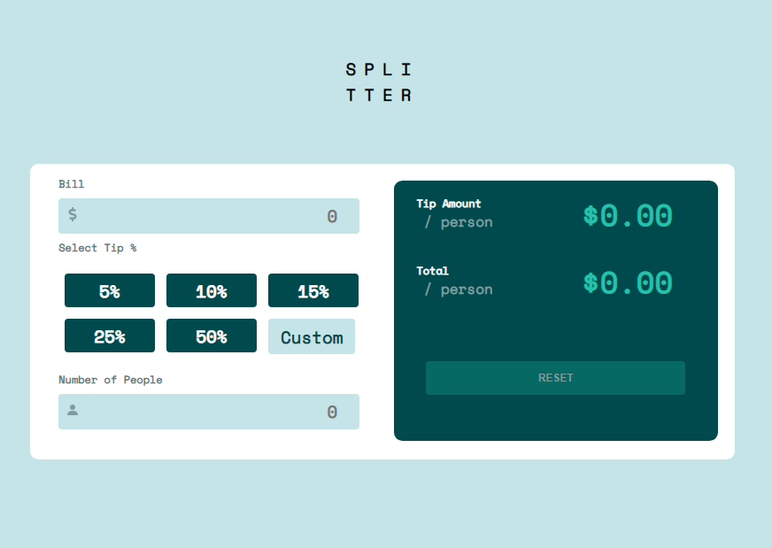

# tip-calc# Frontend Mentor - Tip calculator app solution

This is a solution to the [Tip calculator app challenge on Frontend Mentor](https://www.frontendmentor.io/challenges/tip-calculator-app-ugJNGbJUX). Frontend Mentor challenges help you improve your coding skills by building realistic projects.

## Table of contents

- [Overview](#overview)
  - [The challenge](#the-challenge)
  - [Screenshot](#screenshot)
  - [Links](#links)
- [My process](#my-process)
  - [Built with](#built-with)
  - [What I learned](#what-i-learned)
  - [Continued development](#continued-development)
  - [Useful resources](#useful-resources)
- [Author](#author)
- [Acknowledgments](#acknowledgments)


## Overview

### The challenge

Users should be able to:

- View the optimal layout for the app depending on their device's screen size
- See hover states for all interactive elements on the page
- Calculate the correct tip and total cost of the bill per person

### Screenshot



### Links

- Solution URL: [Add solution URL here](https://your-solution-url.com)
- Live Site URL: [Add live site URL here](https://your-live-site-url.com)

## My process

### Built with

- Semantic HTML5 markup
- CSS custom properties
- Flexbox
- [React](https://reactjs.org/) - JS library


### What I learned

In the process of building this tip calculator, i learnt about a React Hook Usestate. This is used in state declaration. It can also be used to hide a HTML element and show it when a certain boolean is true or false.

```html
{ valid && <label className="label_invalid" htmlFor="number">Can't be zero</label>}
```
```css
.label_invalid {
  display: inline-block;
  width: 45%;
  margin: 0.2rem 0;
  font-size: 15px;
  color:  hsl(186, 14%, 43%);
  font-weight: bold;
  text-align: end;
  color: red;
}
```
```js
import {useState} from 'react';
const [ valid, setValid ] = useState(false);

 if (numOfPeople <= 0) {
            setValid(true)
        }
}
```


### Continued development

React Hooks has alot of functions which i want to improve on.
And how to write a React functional component, since React is all about re using components.


### Useful resources

- [React](https://reactjs.org/) - JS library


## Author

- Frontend Mentor - [@Geraldoeze](https://www.frontendmentor.io/profile/Geraldoeze)


## Acknowledgments

I would like to acknowledge my brother Emmanuel Ezenagu. A software engineer with lots of experience, he has always been a mentor and motivator to me. 
